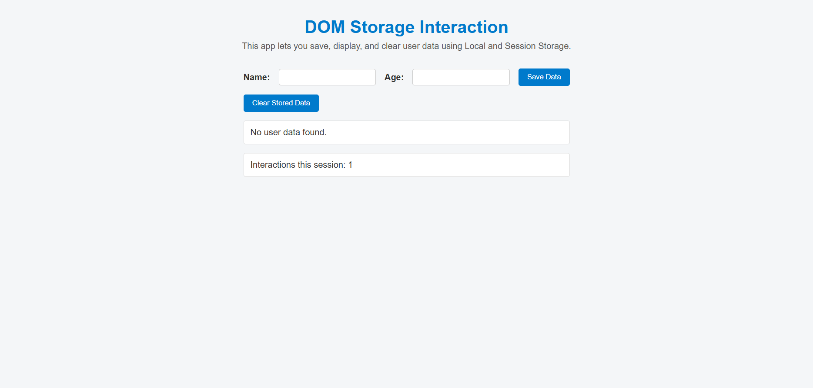

# 💾 DOM Storage Interaction

🔗 **[Try it here!](https://carturo8.github.io/dom-storage-interaction/)**

A simple web application that allows users to store and display personal data using the DOM API, Local Storage, and Session Storage. Built with HTML, CSS, and vanilla JavaScript.

---

## 🖼️ Preview



---

## 🚀 Features

- Dynamic form for name and age input.
- Data is saved in **Local Storage**.
- Page interactions are counted using **Session Storage**.
- Data is displayed immediately on screen.
- User can clear stored data.
- Responsive layout and clean design.
- Alerts and confirmations with [SweetAlert2](https://sweetalert2.github.io/).

---

## 🛠 Technologies Used

- HTML5.
- CSS3.
- JavaScript (ES6+).
- Local Storage API.
- Session Storage API.
- [SweetAlert2](https://cdn.jsdelivr.net/npm/sweetalert2@11).

---

## 📁 Project Structure

```bash
dom-storage-interaction/
│
├── src/
│   ├── css/
│   │   └── styles.css
│   └── js/
│       └── main.js
│
├── assets/
│   └── img/
│       └── preview.png
│
├── index.html
├── .gitignore
├── LICENSE
└── README.md
```

---

## 📝 File Descriptions

- `index.html`: Main HTML structure and UI layout of the app.
- `.gitignore`: Specifies files and folders to exclude from version control.
- `LICENSE`: MIT license for open-source distribution.
- `README.md`: Project documentation and usage instructions.
- `src/css/styles.css`: Custom styles for layout, responsiveness, and UI design.
- `src/js/main.js`: Main JavaScript logic for DOM manipulation and storage interaction.
- `assets/img/preview.png`: Screenshot of the app displayed in the README.

---

## 📦 Installation & Running

1. Clone the repository:

   ```bash
   git clone https://github.com/Carturo8/dom-storage-interaction.git
   cd dom-storage-interaction
   ```

2. Open `index.html` in your browser (no server required).

---

## 💡 How to Use

1. Enter your **name** and **age** in the form fields.
2. Click **Save Data** to store the information.
3. Your data will appear below and remain saved using **Local Storage**.
4. The interaction counter increases with each action (form submit or clear).
5. Click **Clear Stored Data** to remove saved data and reset the form.

---

## ✅ Requirements

- Modern web browser (Chrome, Firefox, Edge, etc.).
- No internet connection required after first load (all scripts are local).
- JavaScript must be enabled.

---

## 📄 License

This project is licensed under the MIT License – see the [LICENSE](https://github.com/Carturo8/dom-storage-interaction/blob/main/LICENSE) file for more details.
